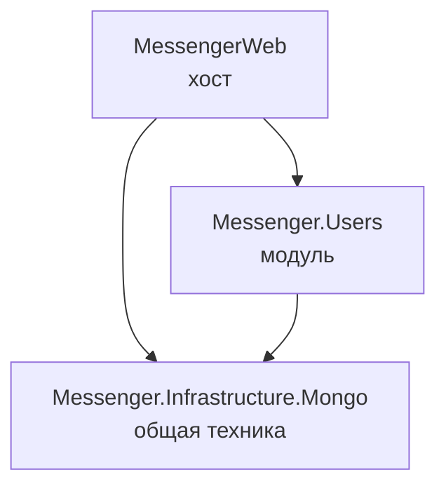

# Messenger Backend

Бэкенд мессенджера на .NET 10. Модульный монолит: одно приложение, разделённое на независимые модули, внутри модулей — DDD.

Сейчас готов модуль **Users**: регистрация аккаунта и профиль пользователя.

## Стек

- **.NET 10**, ASP.NET Core (контроллеры), Swagger
- **MongoDB** — драйвер 3.x
- **[Mediator](https://github.com/martinothamar/Mediator)** — CQRS на source generator (не MediatR)
- `PasswordHasher` из ASP.NET Core Identity для хеширования паролей

## Быстрый старт

Нужны .NET 10 SDK и MongoDB. Проще всего поднять Mongo в Docker:

```bash
docker run -d --name messenger-mongo -p 27017:27017 mongo:8
```

Запуск:

```bash
dotnet run --project MessengerWeb
```

- API: `http://localhost:5243` (профиль `https` — ещё `https://localhost:7036`)
- Swagger: `http://localhost:5243/swagger` (только в Development)
- Готовые запросы для Rider: [`MessengerWeb/MessengerWeb.http`](MessengerWeb/MessengerWeb.http)

При старте приложение создаёт индексы в Mongo, поэтому без доступной базы оно не запустится.

### Конфигурация

`MessengerWeb/appsettings.json`:

```json
"Mongo": {
  "ConnectionString": "mongodb://localhost:27017",
  "DatabaseName": "Messenger"
}
```

Через переменные окружения: `Mongo__ConnectionString`, `Mongo__DatabaseName`.

## Структура решения

```
Messenger.sln
├── MessengerWeb                     — хост: Program.cs, контроллеры, обработка ошибок
├── Messenger.Infrastructure.Mongo   — общее подключение к Mongo (AddMongo)
└── Messenger.Users                  — модуль Users
    ├── Domain                       — агрегаты, value objects, события, интерфейсы репозиториев
    ├── Application                  — команды, запросы и их handler-ы
    ├── Infrastructure               — репозитории, BSON-маппинг, индексы
    └── UsersModule.cs               — AddUsers() / InitializeUsers()
```

## Архитектура

### Модульный монолит



- **Хост** (`MessengerWeb`) только собирает приложение: вызывает `AddMongo()`, затем `AddXxx()` каждого модуля и отдаёт HTTP.
- **Модуль** — один проект со слоями-папками. Модуль владеет своими данными: свои коллекции, репозитории, маппинг. Другие модули не лезут в его репозитории.
- **`Messenger.Infrastructure.Mongo`** — общая техника, которая ничего не знает о предметной области: клиент, база, сериализатор `Guid`. Хранилище конкретного модуля сюда не переносится.

### Модуль Users: два контекста

| | **Identity** (`Account`) | **Profiles** (`UserProfile`) |
|---|---|---|
| Отвечает за | вход и безопасность | то, как пользователя видят другие |
| Данные | email, хеш пароля, статус | имя, аватар, bio |
| Коллекция | `users` | `user_profiles` |

Общее у них только идентификатор: `UserProfile.UserId == Account.Id`.

Регистрация создаёт **только аккаунт**. Профиль заполняется отдельным запросом (как экран «Как вас зовут?» в Telegram), поэтому аккаунт без профиля — нормальное состояние, а каждая операция пишет ровно в один контекст.

### DDD внутри модуля

- **Агрегаты** создаются только через фабрики (`Account.Register`, `UserProfile.Create`): приватные конструкторы и сеттеры, невалидный объект собрать нельзя.
- **Value objects** `Email` и `DisplayName` валидируют и нормализуют значение в конструкторе (email — `Trim` + нижний регистр).
- **Доменные события.** Агрегат наследует `AggregateRoot` и копит события (`Account.Register` → `AccountRegistered`). Handler публикует их через Mediator **после** сохранения агрегата.
- **Handler-ы только координируют**: загрузить → вызвать метод модели → сохранить → опубликовать события. Бизнес-правила живут в модели.
- **Домен не знает про Mongo.** Маппинг (`_id` профиля, сериализаторы value objects) — в `Infrastructure/UsersBsonMappings.cs`.

### Хранение в Mongo

- Value objects хранятся **обычными строками** через свои сериализаторы, а не вложенными документами — `{ "Email": "foo@example.com" }`.
- `Guid` хранится в стандартном формате (binary subtype 4).
- Уникальный индекс `ux_users_email` на `users.Email` — защита от гонки двух одновременных регистраций.
- Профиль сохраняется upsert-ом: создание и редактирование — одна операция.

### Ошибки и валидация

Валидация в два уровня:

1. **На входе API** — DataAnnotations на командах/запросах, `[ApiController]` возвращает 400 с ошибками по полям.
2. **В домене** — value objects и методы агрегатов. Это источник истины: правило нельзя обойти, отправив команду не через HTTP. Исключение — длина пароля: в домен попадает уже хеш, поэтому она проверяется только на входе API.

Исключения домена превращаются в [ProblemDetails](https://www.rfc-editor.org/rfc/rfc9457) в `MessengerWeb/DomainExceptionHandler.cs`:

| Исключение | Код |
|---|---|
| `EmailAlreadyTakenException` | 409 |
| `AccountNotFoundException` | 404 |
| любое другое `DomainException` | 400 |
| всё остальное | 500 (без стектрейса) |

## Правила архитектуры

Новый код обязан следовать этим правилам. Если задача в них не укладывается — сначала обсуди, потом отступай. Подробный чеклист (стиль кода, Mongo, git) — в [CLAUDE.md](CLAUDE.md), его же автоматически читает Claude Code.

### Модули

- **Модуль = bounded context.** Новая предметная область (чаты, сообщения) — новый модуль, а не папка в существующем.
- **Модуль владеет своими данными.** Он читает и пишет только свои коллекции; запросов в чужие коллекции нет.
- **Модули общаются только через контракты** — проект `Messenger.<Module>.Contracts` с публичными запросами и интеграционными событиями из примитивов. Чужие `Domain`, репозитории и доменные события использовать нельзя.

*Почему:* модули остаются независимыми — изменения в одном не ломают другие, а любой модуль при необходимости можно вынести в отдельный сервис.

### Пользователи в других модулях

- **Пользователь — это `UserId`.** Общего класса `User` нет: другие модули не используют `Account` и `UserProfile`.
- **У каждого модуля своя модель человека** с тем, что важно именно ему. Например, в чатах — `ChatMember { UserId, Role, IsMuted, JoinedAt }`.
- **Имя и аватар не копируются** в чужие документы (например, в сообщения). Хранится `UserId`, профиль подставляется при чтении.

*Почему:* один и тот же человек в разных контекстах — разные понятия. Роль в чате не нужна аккаунту, хеш пароля не нужен чату. А скопированное имя пришлось бы обновлять в тысячах сообщений.

### Домен

- **Домен не зависит от инфраструктуры**: никакого Mongo и ASP.NET. Маппинг — только в `Infrastructure`.
- **Правила живут в модели** — в методах агрегатов и value objects. Handler только координирует: загрузить → вызвать метод модели → сохранить → опубликовать события.
- **Агрегаты создаются фабриками**, без публичных конструкторов и сеттеров.
- **Ошибки домена** — наследники `DomainException`; код ответа задаётся в `DomainExceptionHandler`.

### Данные

- **Value objects хранятся плоскими строками**, не вложенными документами.
- **Коллекции, поля и индексы не переименовываются без миграции данных.** Поэтому коллекция аккаунтов до сих пор называется `users`.

## API

| Метод | Путь | Описание | Ответы |
|---|---|---|---|
| `POST` | `/api/account/register` | `{ email, password }` → `{ accountId }` | 200, 400, 409 |
| `GET` | `/api/profiles/{userId}` | профиль пользователя | 200, 404 — профиль ещё не заполнен |
| `PUT` | `/api/profiles/{userId}` | `{ displayName, bio? }`, создаёт или обновляет | 204, 400, 404 — нет аккаунта |

Ограничения: email до 254 символов, пароль 8–128, имя 1–64, bio до 500.

## Как добавить модуль

1. Проект `Messenger.<Module>` со ссылкой на `Messenger.Infrastructure.Mongo`, папки `Domain` / `Application` / `Infrastructure`.
2. `<Module>Module.cs` с `Add<Module>()` (репозитории, BSON-маппинг) и, если нужны индексы, `Initialize<Module>()`.
3. Свои коллекции — имена в константах репозиториев.
4. Если модуль нужен другим — проект `Messenger.<Module>.Contracts` с публичным API и интеграционными событиями. Сам модуль ссылается только на контракты других модулей.
5. Подключить в `MessengerWeb/Program.cs` после `AddMongo()`.

## Ограничения и планы

- ⚠️ **Нет аутентификации.** `PUT /api/profiles/{userId}` может отредактировать любой профиль. Следующий шаг — вход по JWT, тогда `userId` будет браться из токена.
- **Доменные события не гарантированы.** Если процесс упадёт между сохранением и публикацией, событие потеряется. Когда появятся подписчики — outbox.
- У `AccountRegistered` пока нет подписчиков, отсюда предупреждение `MSG0005` при сборке.
- Нет тестов.
- Впереди: модули Chats и Messages, real-time через SignalR. Целевой результат и план по шагам — в [docs/ROADMAP.md](docs/ROADMAP.md).
